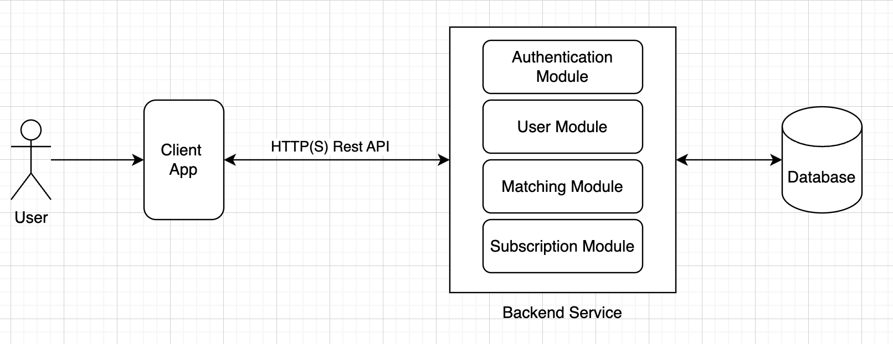

# Cupid

This requirement is only for the MVP version of the tinder/bumble-like app.

The code can be found in this [repository](https://github.com/ardafirdausr/cupid).

The diagrams can be found in this [draw.io](https://drive.google.com/file/d/1mZI80SHS0B5LvmvcMb81fN2onL_vn0EX/view?usp=sharing).

The postman collection can be found in this [link](https://documenter.getpostman.com/view/5968301/2sA3QwbV1q).

## Requirements

### Functional

- User able to sign up to the app
- User able to login to the app
- User able to swipe(like/dislike) other users
  - User can only swipe on a profile once.
  - User can only swipe on 10 profiles total (pass + like) in 1 day (free-plan).
  - User can swipe on unlimited profiles in 1 day (premium-plan).
- User able to view other users
  - Same profiles can’t appear twice.
- User able to purchase premium packages that unlocks one premium feature
  - Options:
    - No swipe quota for user
    - Verified label for user

#### Functional that will not be implemented in the MVP

- User able to chat with other users
- User able to upload photos
- User able to view other users that have liked them
- User able to view other users that they have liked
- User able to view other users that they have matched with
- User able to view other users using filter
  - filter by age
  - filter by location
- ...Other features

## MVP

### Software Architecture

#### High Level Design

The software architecture will be a monolithic architecture. The reason for choosing a monolithic architecture is because it is easier to develop and deploy. The app is also small enough that a monolithic architecture is sufficient.

### Data Design

This is the ERD for the MVP version of the app. The app will have 2 entities: User and Subscription.

- The user has one to many relationships with the subscription. In this relationships, the user can have multiple subscriptions but only one subscription can be active at a time. Also this relationship also has attributes to store the user's subscription purchase.
- The user has many to many relationships with the user. In this relationships, the user can have multiple users that they have swiped on and multiple users that have swiped on them. This relationship also has attributes to store the user's swipe status.

#### Technical Stack

- **Programming Language:** Go  
  The reason for choosing Go is because it is a statically typed language that is easy to read and write.
- **Database:** MongoDB
  In this usecase which the data is not relational, structure is not fixed, and does not require ACID properties, MongoDB is a good choice because it is a NoSQL database that is easy to scale horizontally. It is also a good choice because it is a document-based database which means it is easy to store and retrieve data.
